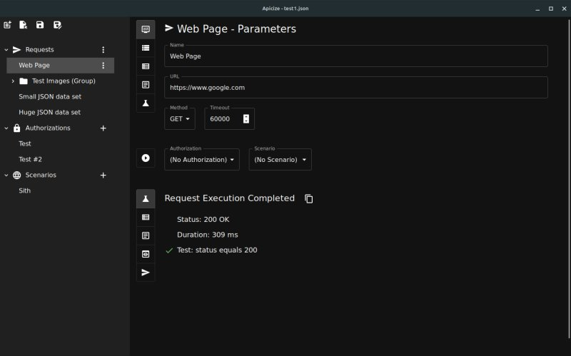

# Apicize

## Overview

Apicize is intended as a testing platform that facilitates webservice testing both via GUI and CLI.  It utilizes Rust and V8
to execute the testing, and Tauri, React and Redux for the UI.

### Contents

* [Project Organization](#project-organization)
* [Apicize Terminology](#apicize-terminology)
* [License and Attributions](#license-and-attributions)
* [Technology Choices](#technology-choices)
* [To-Do List](./TODOs.md)

### Features

* Cross-platform (Linux, Windows and Mac)
* Test webservices without having to create an account with a third-party (which, for the record, I wouldn't mind paying 
for an excellent tool, but am not interested in yet *another* subscription that I have to pay *indefinitely*)
* *Testability* as a first-class concept; *safe*, frictionless BDD-style JavaScript testing as opposed to just looking for a "200" response
* Execute, at scale, tests in CI/CD pipelines with a low-overhead CLI exeutable (i.e. without UI "baggage")

In reality, this effort is very much a *My First Tauri, React, Redux and V8 project*.  It is a work-in-progress of somebody who bit off more than
they could chew.  People who actually know these technologies will probably need to fight back nausea as they look at this project.
There are anti-patterns and abuse of old techniques that have been replaced with something better, but unknown by the author whose eyes no
longer function properly after countless hours on Stack Overflow, Reddit, and buying Rust and React hints from a guy selling them from the
back of a van.

All that said, there could be something useful here to build upon.  I'm looking forward to working with folks to build something cool.

## Apicize Terminology

The following are terms used in Apicize

* *Request*:  Information required to make a webservice call *and* evaluate its succesful completion.  Success may be defined as a 200 status,
it may involve evaluating the response body, or it may be a negative test (i.e. you expect to get a 404 Not Found)
* *Authorization*:  Webservices often enforce authorization of the caller.  Currently supported authorizations include Basic Authentication, API Key Authentication, and OAuth2 Client Authentication
* *Scenarios*:  A list of variables that can be substituted in a Request.  For example, you may have a set of calls that you want to test against different products.  Rather than having to create a copy of those requests, you can just execute the same tests against different scenarios.
* *Workbook*:  Contains a set of Requests, Authorizations and Scenarios
* *Test*:  

## Project Organization

These are the components that comprise Apicize:

* [**app**](./@apicize/app/README.md): Tauri user application to interactively edit and execute tests
* [**cli**](./@apicize/cli/README.md): Rust CLI application to execute tests
* [**lib-rust**](./@apicize/lib-rust/README.md): Rust crate for executing tests
* [**lib-typescript**](./@apicize/lib-typescript/README.md): TypeScript definitions for Apicize test workbook data structures
* [**toolkit**](./@apicize/toolkit/README.md):  React/reduct UI component toolkit

Ideally, you could reuse these components to build things like a Visual Studio Code extension, a hosted solution to execute
Apicize tests, etc. 

There are no unit or integration tests yet.  This is primarly because this project has been built and rebuilt at least three times (a couple of times in Electron, then Tauri v1 and most recently, Tauri v2 beta).  You can read more about this trail-of-tears [here](#technology-choices).

As things begin to stabilize, I'll build unit and integraiton testing.  Currently, the project is a monorepo but with decent integration testing, there is
no reason why each of these components can't be its own repo, triggering upstream builds upon update, etc.  Assuming this project gets that far...

## Development

### Requirements

You'll need Rust (latest and greatest) and Tauri v2 (currently in beta).  For editing, I've been using Visual Studio Code with the rust-analyzer and CodeLLDB extensions.

The project uses [yarn](https://yarnpkg.com/migration/overview).  Yarn's workspace functionality works better for me than NPMs.

### Building and Debugging

From the project's main directory, run `yarn ui` to build and run the app using development configuration.  Run `yarn ui:watch` do the same thing, but with
rebuild if the either the **lib-typescript** or **toolkit** are updated.  When using watch mode, you'll have to Ctrl-C in the terminal window to completely 
shut things down.

VSCode debugging launch configurations are included.  For some reason, two copies of the app will be launched, have not been able to figure out why yet...

### Running the GUI

To launch the GUI, run 

## License and Attributions

Apicize's applications, libraries and components are licensed under the [Not Yet](./NOT-YET.md) license.  Basically, it's not ready to distribute
at this point.  When this application doesn't suck, I'll formally release it with a nice copy-left license and call it a day.

Apicize would not be possible without the excellent work of the following projects:

* [Tauri](https://tauri.app/)
* [Rust](https://www.rust-lang.org/)
* [React](https://react.dev/)
* [Redux](https://redux.js.org/)
* [V8](https://v8.dev/)
* Tons of other libraries, crates, etc. that hold it all together

Thanks to everybody.  It's amazing that all of this technology is available to freeloaders like me.

## Technology Choices

Why Tauri and Rust?  Why V8?  Originally, this project was built using Electron and NodeJS.  Both are great, but eventually I ran into challenges.

* Perhaps a petty issue, but Electron has a [long-standing issue](https://github.com/electron/electron/issues/32857) in Linux where file dialogs do not open in the foreground after the initial display.  This drives me beserk with Visual Studio Code.  If Electron won't (or can't) fix something this fundamental in the span of over two years, it makes me question their commitment to Linux
* In theory, if your application is going to support executing arbitrary JavaScript tests and your application is Electron/NodeJS, it should be easy.  The problem comes when you want to do so *safely*.  It is nearly impossible to prevent such code from accessing the file system, making HTTP calls, etc.  Using something like Deno gives you more control over what the code can do, but it would be one more thing to bundle.  V8 provides a minimalistic sandbox to run JavaScript code in that is a lot easier to dial in the safety on.
* Electron just seem "bloated".  Of course, a great deal of this bloat is likely coming from React, Redux, etc. but Tauri, so far, seems to be tighter with regard to memory footprint.
* For CLI applications, Rust is a non-brainer compared to NodeJS. 
* JSON with JavaScript and NodeJS has always felt like a compromise.  You get typing, but that only tells you what something *should be*, but does not guarantee what it *actually is*.  With Rust and Serde, if you deserialize something to a struct with a numeric property, that number is going to be a number - period.
* I thought it would be cool to learn Rust (lol)
